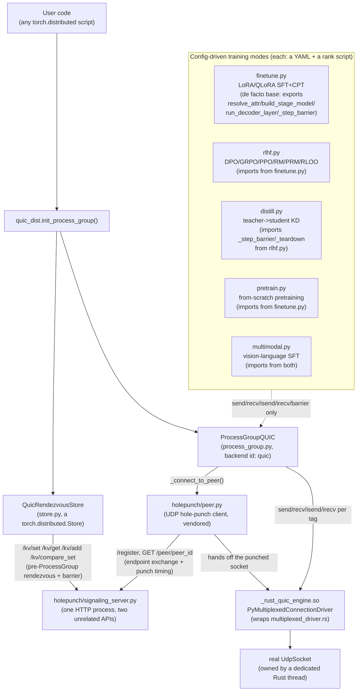
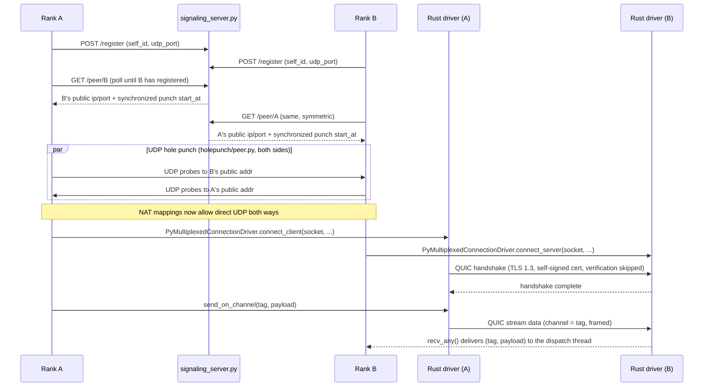

# Architecture

How `quic_dist` fits together: a real `torch.distributed.ProcessGroup`
backend over QUIC, plus five config-driven training modes built on top
of it. This replaces what used to be a single link to an external,
inaccessible artifact — everything here lives in the repo and renders
natively on GitHub.

## Component overview



The two dotted/dashed edges above matter: `QuicRendezvousStore` and
`holepunch/peer.py` both talk to the SAME signaling-server HTTP process,
but over completely different, unrelated path families, for
completely different purposes — see "Two signaling flows, one HTTP
process" below, since this is easy to conflate and the two were built
independently.

## Connection establishment (sequence)

What actually happens when rank A calls `dist.send(tensor, dst=B, tag)`
for the first time, and no connection to `B` exists yet
(`ProcessGroupQUIC._get_or_connect` → `_connect_to_peer`):



Every later `send`/`recv` on the same peer pair reuses this same
connection and just opens a new named channel per `tag` — no repeat
hole-punch or handshake. `ProcessGroupQUIC._retry_dead_conn` transparently
re-runs this whole sequence if the connection died since it was last
used (see `docs/development-log.md`'s "Parallel-stream send/recv stall"
entry for the real race this closes).

## Two signaling flows, one HTTP process

`holepunch/signaling_server.py` is a single FastAPI app that serves
**two genuinely unrelated APIs**, easy to conflate because they share a
process and a `signaling_url`:

| | Hole-punch (`holepunch/peer.py`) | Rendezvous store (`store.py`'s `QuicRendezvousStore`) |
|---|---|---|
| Endpoints | `POST /register`, `GET /peer/{peer_id}` | `POST /kv/set`, `GET /kv/get`, `POST /kv/add`, `POST /kv/compare_set`, `DELETE /kv` |
| Called from | `ProcessGroupQUIC._connect_to_peer`, lazily, per peer pair, only once a `send`/`recv` to that peer is actually attempted | `dist.init_process_group()`'s own rendezvous + `_store_based_barrier`, BEFORE any `ProcessGroup` exists |
| Purpose | Exchange public UDP endpoints + a synchronized punch timestamp so two NAT'd machines can establish a direct UDP path | A generic key-value store torch's own rendezvous machinery needs — has nothing to do with UDP/NAT at all |
| Imports | `store.py` never imports `holepunch.peer` | `holepunch/peer.py` never imports `store.py` |

## Rust workspace

One Cargo workspace (`rust/Cargo.toml`), two members:

- **`quic_engine`** — pure Rust, no PyO3. `engine.rs` drives one
  `quinn_proto::Endpoint`+`Connection` (sans-io — no socket I/O of its
  own). `multiplexed_driver.rs` is the multi-channel connection driver
  **this project actually uses** (one QUIC connection, many named
  logical channels, one per `tag`). `driver.rs` is an older
  single-channel driver — **intentionally kept, not used by
  `ProcessGroupQUIC`**, retained as a known-good reference
  implementation: several real bugs in `multiplexed_driver.rs` (see
  `docs/development-log.md`) were found by diffing its behavior against
  this simpler, already-validated sibling. `congestion.rs` wraps any
  `quinn_proto::congestion::Controller` with a hard ceiling matched to
  the real OS socket buffer size, `cert.rs` generates the self-signed
  TLS cert, `error.rs` defines the shared `Result`/error type.
- **`quic_engine/python`** — thin PyO3 bindings
  (`_rust_quic_engine` cdylib). Three `#[pyclass]`es: `PyMultiplexedConnectionDriver`
  (used — wraps `multiplexed_driver.rs`), `PyQuicConnectionDriver` and
  `PyQuicEngine` (both intentionally unused by `ProcessGroupQUIC`, same
  reference-implementation status as `driver.rs`).

`rust/quic_engine/tests/loopback.rs` is a real 2-`Engine` TLS 1.3
handshake test with no PyO3/asyncio involved — the lowest-level
correctness check in the repo.

## Data flow for one `dist.send`

```
dist.send(tensor, dst, tag)
  -> ProcessGroupQUIC.send (process_group.py)
  -> quic_dist.tensor.serialize_tensor(tensor)   # struct-packed binary header + raw bytes
  -> self._get_or_connect(dst)                   # reuses an existing connection, or runs the sequence above
  -> _PeerConnection.send(tag, payload)
  -> _qe.PyMultiplexedConnectionDriver.send_on_channel(tag, payload)
  -> Rust background thread: writes onto tag's QUIC stream, drives poll_transmit()
  -> real UdpSocket.send_to()
```

`isend`/`irecv` (`work.py`) wrap the same calls on a background Python
thread, returning a real `torch.futures.Future`-backed `torch.distributed.Work`
so the caller isn't blocked — this is what `finetune.py`'s
`overlap_communication`/`pipeline_overlap_microbatches` build on top of
(see `docs/development-log.md`).

